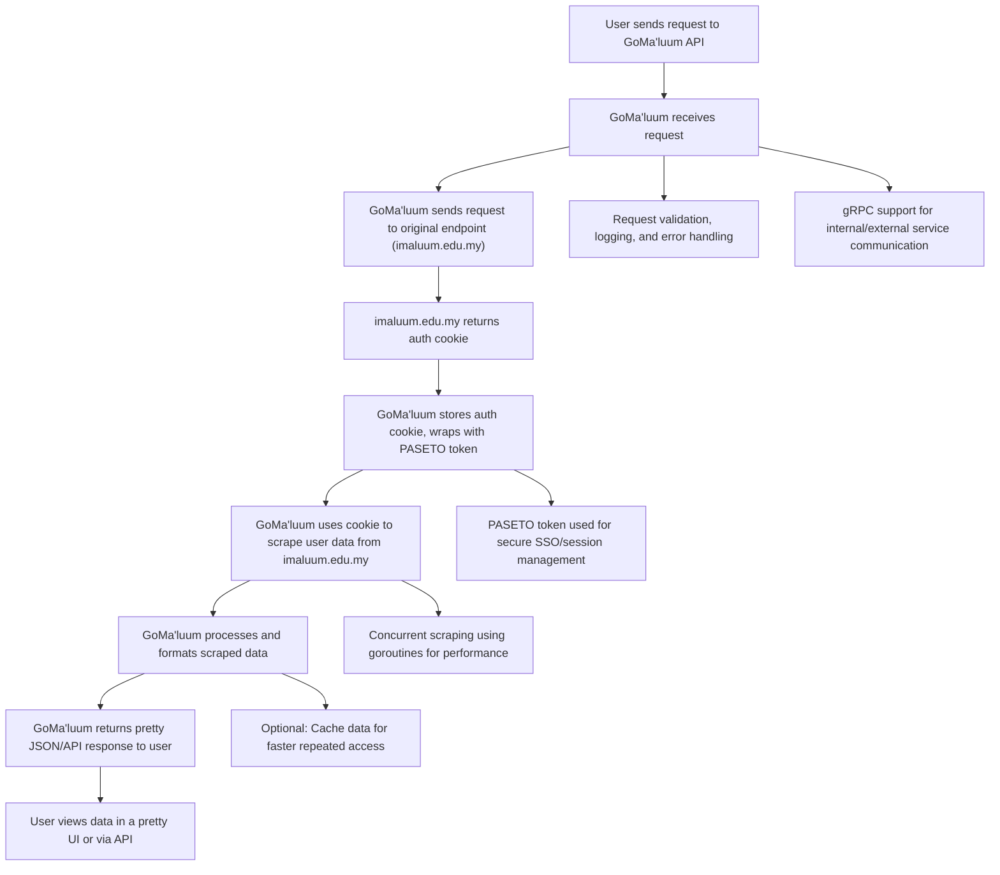

GoMa'luum
=========

🚧 **In Construction** 🚧
-------------------------

> [!IMPORTANT] 
> This project is **not** associated with the official i-Ma'luum!

A proxy API which enables developers to build applications on top of i-Ma'luum.
Primarily used be some IIUM's student-made app:
- [Simplified i-Ma'luum](https://imaluum.quddus.my)
- [ProReg](https://proreg.app)

Swagger API documentation is available at [here](https://api.quddus.my/api/reference).

How it works under the hood
------------------------------------------




Local installation
------------------

> Requires go >= 1.23

```
git clone http://github.com/nrmnqdds/gomaluum
cd gomaluum
go mod tidy
air
```

Using Docker
------------

```
docker build -t gomaluum .
docker run -p 1323:1323 -d gomaluum
```

Support this project!

[](https://www.buymeacoffee.com/nrmnqdds)

